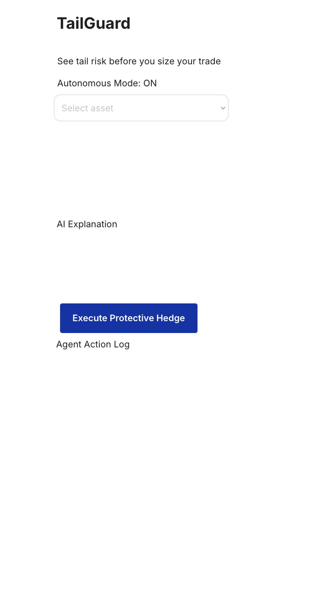
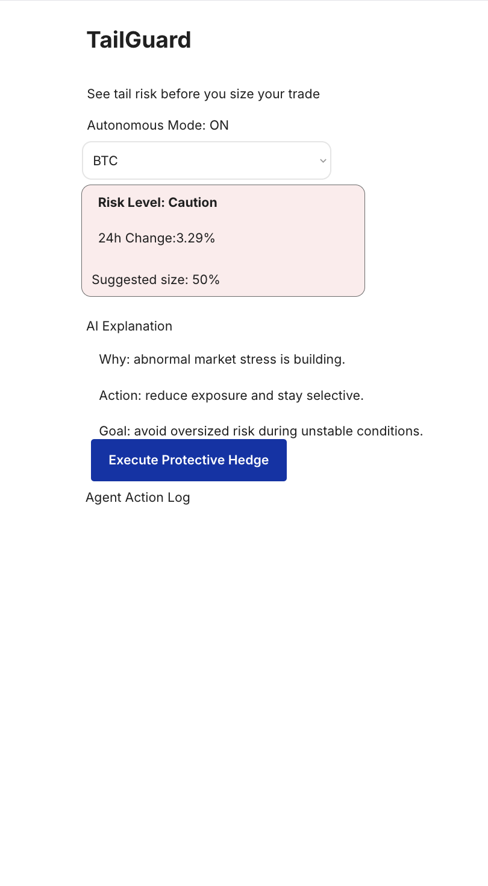
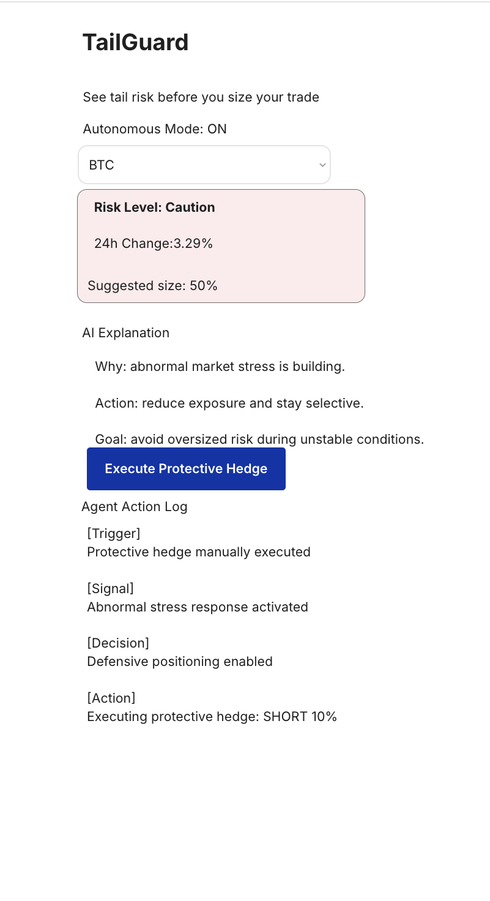

# TailGuard

TailGuard is a retail-friendly crypto tail-risk dashboard that turns market stress into clear position guidance before users size a trade.

## What it does

TailGuard helps users detect abnormal market stress and convert it into simple, action-oriented guidance.

The current product flow is:

- Select an asset
- Fetch live market data
- Detect the current risk state
- Show suggested position sizing
- Explain the reason in plain language
- Trigger a protective hedge flow

## Current MVP

The current MVP includes:

- Live market input via API
- Risk Level display
- 24h Change display
- Suggested size display
- AI Explanation block
- Protective Hedge action button
- Agent Action Log
- Bubble → Cloudflare Worker webhook connection

## Why it matters

Most retail users do not need more noise.
They need a simple answer to one question:

**“Should I size normally, reduce exposure, or hedge?”**

TailGuard is designed as a lightweight risk guidance layer that helps users react before a bad sizing decision is made.

## Current user flow

1. User selects BTC
2. TailGuard fetches market data
3. TailGuard classifies the current risk state
4. TailGuard shows:
   - Risk Level
   - 24h Change
   - Suggested size
   - AI Explanation
5. User can trigger **Execute Protective Hedge**
6. The action is logged in the Agent Action Log
7. A webhook call is sent from Bubble to a Cloudflare Worker for execution-ready hedge flow

## Protective Hedge flow

Current implementation:

- Button click inside Bubble
- Action Log updates to protective hedge mode
- Webhook request is sent to Cloudflare Worker
- Worker returns an execution-ready response

This means TailGuard is no longer just a static mockup.
It now includes an external protective action layer.

## Tech stack

- Bubble
- Cloudflare Workers
- API Connector
- Webhook-based execution-ready flow

## Current status

Completed:

- Bubble UI / UX flow
- Conditional display for risk card
- AI Explanation alignment
- Protective Hedge button
- Agent Action Log switching
- Bubble → Cloudflare Worker webhook integration

In progress / next step:

- Signed SoDEX execution layer
- Deeper risk signals beyond current MVP
- Stronger agentic automation logic

## Demo

Live demo:
`https://asa55no.bubbleapps.io/version-test?debug_mode=true`

## GitHub

This repository contains the current TailGuard MVP and supporting project materials.

## Positioning

TailGuard is evolving from a market-stress visualization tool into an **agentic risk guidance layer** for retail crypto users.

It is designed to bridge:

**market stress → position guidance → protective action**
## Additional Screenshots

### Empty State

### BTC Selected

### Protective Hedge Triggered

