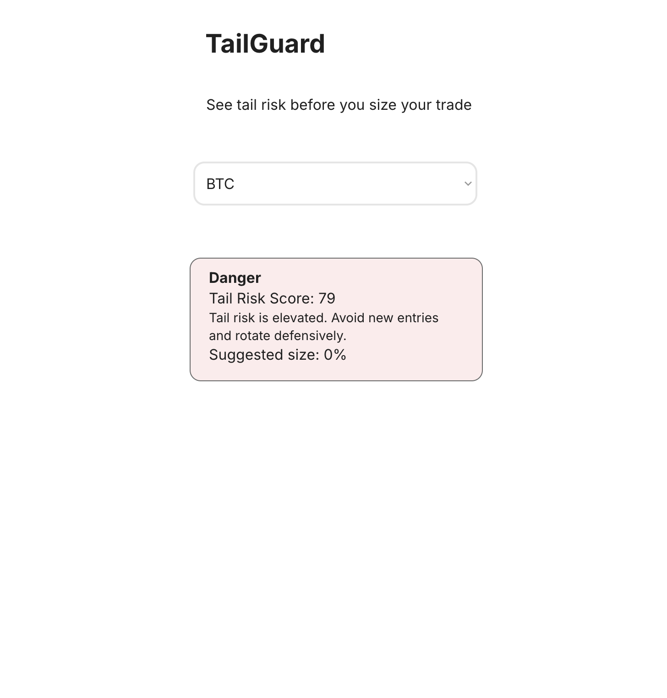

# TailGuard

TailGuard is a retail-friendly crypto tail-risk dashboard designed to help users avoid bad sizing decisions during abnormal market conditions.

## What it does
TailGuard translates market stress into a simple retail decision interface:
- risk state
- Tail Risk Score
- plain-language summary
- suggested size

## Current MVP
The current MVP is built in Bubble.

Current BTC demo shows:
- Danger
- Tail Risk Score: 79
- warning summary
- Suggested size: 0%

## Why it matters
TailGuard is not trying to predict price perfectly.
It helps retail users avoid oversized risk during tail-risk conditions.

## Status
Working MVP

## Stack
- Bubble

## Next steps
- add more assets
- improve signal depth
- refine retail UX
## Demo Screenshot

Current TailGuard MVP interface showing BTC risk state, Tail Risk Score, summary, and suggested size.

